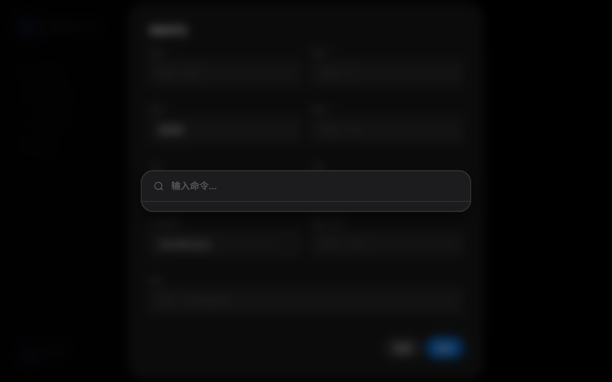
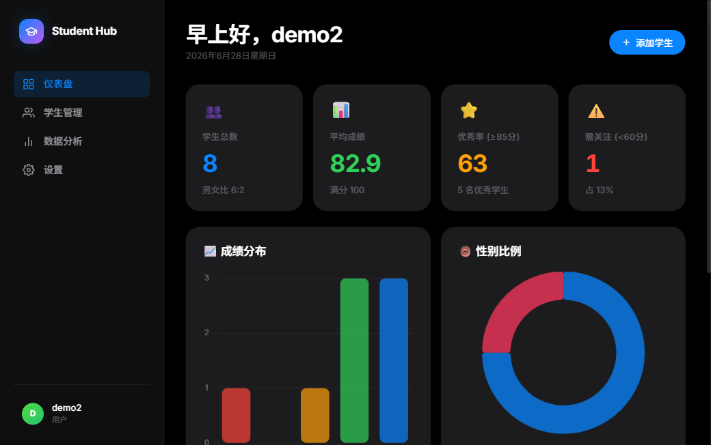
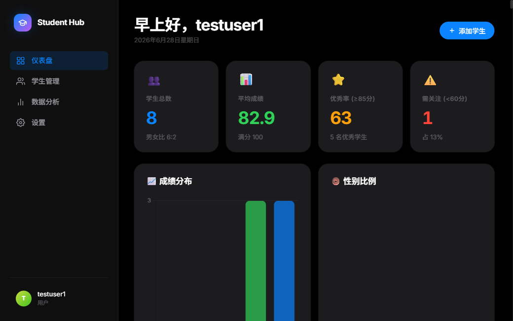
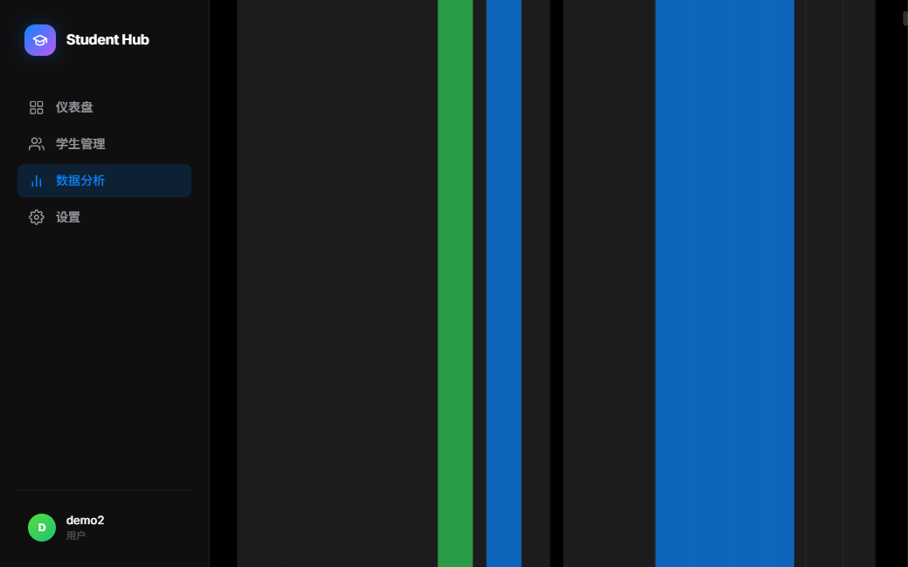

# Student Hub — 学生数据管理平台

基于 **FastAPI + MySQL** 的多用户学生信息管理系统。支持 JWT 认证、多用户数据隔离、CRUD 完整闭环、搜索筛选分页排序、数据统计图表、CSV 导出与审计日志。


---

## ✨ 功能特性

- **用户认证** — JWT 令牌 + bcrypt 密码哈希，独立注册与登录
- **多用户数据隔离** — 每个用户只能管理自己创建的学生数据，SQL 层强制 `user_id` 过滤
- **学生 CRUD** — 添加、编辑、软删除、批量删除、恢复已删除
- **搜索与筛选** — 按姓名模糊搜索，按班级、性别、成绩范围筛选
- **分页与排序** — 前端分页控件 + 多字段排序（姓名/年龄/成绩/班级/入学日期）
- **数据统计** — 仪表盘总览、成绩分布柱状图、月度入学折线图、班级对比
- **CSV 导出** — 支持 Excel/WPS 中文兼容的 UTF-8 BOM 导出
- **审计日志** — 记录所有增删改操作，含 IP 地址与操作时间
- **限流保护** — 登录接口 5次/分钟，全局 60次/分钟
- **暗色主题 UI** — 深色背景 + 高对比度卡片，Apple 风格设计

---

## 🛠️ 技术栈

| 层级 | 技术 |
| :--- | :--- |
| 框架 | FastAPI |
| 服务器 | Uvicorn |
| 数据库 | MySQL 8.0 + PyMySQL |
| 认证 | JWT (PyJWT) + bcrypt |
| 数据校验 | Pydantic v2 |
| 限流 | slowapi |
| 前端 | 原生 HTML5 / CSS3 / JavaScript (ES6+) |
| 图表 | Chart.js 4.4 |

---

## 📁 项目结构

```
student_system_pro/
├── main.py                  # FastAPI 应用入口，中间件，路由注册
├── config.py                # 集中配置（环境变量）
├── database.py              # 数据库连接与自动建表
├── auth.py                  # JWT 令牌 + bcrypt 密码哈希
├── models.py                # Pydantic 请求/响应模型
├── routers/
│   ├── auth_router.py       # 注册 / 登录 / 个人信息
│   ├── student_router.py    # 学生 CRUD / 批量 / CSV / 筛选
│   └── stats_router.py      # 仪表盘 / 图表 / 审计日志
├── index.html               # 单页前端 (SPA)
├── requirements.txt         # Python 依赖
├── start.sh                 # 一键启动脚本
└── .env.example             # 环境变量模板
```

---

## 🚀 本地运行

### 前置条件

- Python 3.10+
- MySQL 8.0+（需运行中）

### 1. 克隆仓库

```bash
git clone https://github.com/你的用户名/student_system_pro.git
cd student_system_pro
```

### 2. 创建虚拟环境并安装依赖

```bash
python -m venv venv
source venv/bin/activate      # macOS / Linux
# venv\Scripts\activate       # Windows

pip install -r requirements.txt
```

### 3. 配置环境变量

```bash
cp .env.example .env
# 编辑 .env，填入你的 MySQL 密码
```

`.env` 示例：

```env
DB_HOST=localhost
DB_USER=root
DB_PASSWORD=你的MySQL密码
DB_NAME=student_pro_db
DB_PORT=3306
JWT_SECRET_KEY=替换为随机字符串
JWT_EXPIRE_MINUTES=1440
```

### 4. 启动服务

```bash
# 方式一：直接启动
uvicorn main:app --reload --port 8000

# 方式二：使用启动脚本（含内网穿透）
bash start.sh
```

### 5. 访问系统

浏览器打开 `http://127.0.0.1:8000`，注册账号后即可使用。

API 文档自动生成：
- Swagger UI：`http://127.0.0.1:8000/docs`
- ReDoc：`http://127.0.0.1:8000/redoc`

---

## 🗄️ 数据库

首次启动时 `database.py` 会自动创建数据库和表结构，无需手动执行 SQL。

建表语句包括：
- `users` — 用户表（id, username, bcrypt_password, created_at）
- `students` — 学生表（含 soft delete、user_id 外键、索引）
- `audit_logs` — 审计日志表

---

## 📸 效果预览

| 页面 | 预览 |
| :--- | :--- |
| 登录/注册 |  |
| 仪表盘统计 |  |
| 数据列表 |  |
| 统计分析 |  |

---

## 🏆 项目亮点（适合简历展示）

**后端工程实践：**
- RESTful API 设计，遵循 FastAPI 最佳实践
- JWT 无状态认证 + bcrypt 密码加盐哈希
- Pydantic v2 请求校验，自动生成 OpenAPI 文档
- 中间件层：CORS、全局异常处理、slowapi 限流
- 数据库层：软删除、索引优化、参数化查询防 SQL 注入
- 审计日志：全操作追踪，IP 记录

**安全设计：**
- 所有 SQL 使用参数化查询，杜绝注入
- 多用户数据隔离：SQL 层强制 `WHERE user_id = %s`
- 密码强度校验（必须含字母+数字）
- 令牌过期机制 + Bearer 认证

**运维友好：**
- 环境变量集中配置
- 启动自动建库建表，零手动 SQL
- 热重载开发模式
- 健康检查端点 `/health`

---

## 📋 Roadmap

- [ ] 管理员角色与权限系统
- [ ] 密码重置（邮箱验证）
- [ ] 数据导入（Excel 批量导入）
- [ ] Docker 容器化部署
- [ ] 前端迁移至 Vue 3 + TypeScript
- [ ] 单元测试 + 集成测试（pytest）
- [ ] CI/CD（GitHub Actions）
- [ ] Redis 缓存层
- [ ] API 版本管理 (`/api/v1/`)

---

## 📄 License

MIT License

---

## 🙋 关于此项目

本项目从零构建，覆盖后端数据库设计、认证鉴权、RESTful API、前端交互、数据可视化、安全隔离等企业级系统核心环节，适合作为计算机专业课程设计或后端方向作品集项目。
